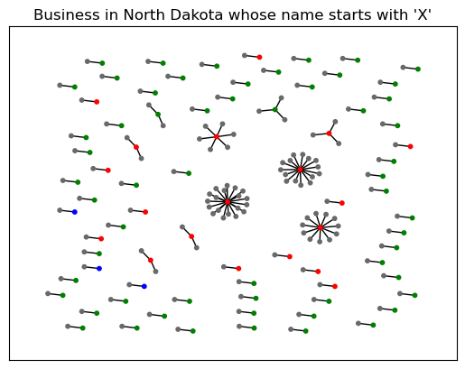

# NDBusinessCrawler

     
    
     

### Context
Web crawlers collect public data from around the globe including: corporate registries, civil litigation registries, customs and import/export data, land and real property ownership, official gazettes, and more. In order for the data to be useful, companies often run entity resolution on the collected data. This allows them to detect when a single company or person is mentioned in two different web pages.

### Entity Resolution
The Secretary of State of North Dakota provides a business search [web app](https://firststop.sos.nd.gov/search/business/) that allows users to search for businesses by name.
This code downloads information for all active companies whose names start with the letter "X" (e.g., Xtreme Xteriors LLC) including their Commercial Registered Agent, Registered Agent, and/or Owners. Then, it creates and plots a graph of the companies, registered agents, and owners.

### Libraries
scrapy, NetworkX
